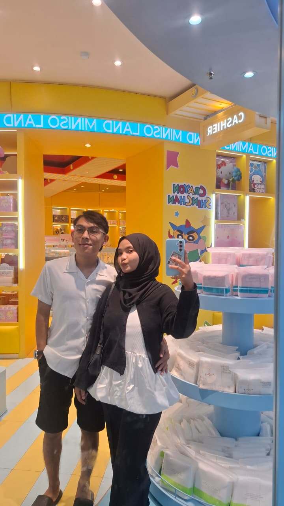

# 💌 Selamat Pagi, Sayang — Website Romantis

Website ini adalah tiruan dari desain "Selamat Pagi, Sayang" lengkap dengan:
- Kelopak bunga & hati yang beterbangan (animasi bergerak terus)
- Efek mengetik pada teks
- Foto berbentuk hati (heartbeat animation)
- Pemutar musik (vinyl berputar saat lagu diputar)
- Hitungan mundur "Sudah bersama selama..." (real-time, otomatis update tiap detik)
- Tombol "Buka Pesan Rahasia" (pop-up modal)
- Jam & tanggal hari ini otomatis (real-time)

---

## 📂 Struktur Folder

```
romantic-website/
├── index.html          → halaman utama
├── css/
│   └── style.css       → semua tampilan & animasi
├── js/
│   └── script.js        → semua logika (jam, timer, musik, dll)
├── assets/
│   ├── images/
│   │   ├── placeholder.svg   → gambar cadangan (jangan dihapus)
│   │   └── couple.jpg        → TARUH FOTO KALIAN DI SINI (nama harus persis "couple.jpg")
│   └── music/
│       └── song.mp3          → TARUH LAGU DI SINI (nama harus persis "song.mp3")
└── README.md            → panduan ini
```

---

## ▶️ Cara Membuka di VS Code

1. Ekstrak (unzip) file `romantic-website.zip`.
2. Buka folder hasil ekstrak di **Visual Studio Code** (`File → Open Folder`).
3. Install ekstensi **"Live Server"** (oleh Ritwick Dey) dari Extensions Marketplace kalau belum ada.
4. Klik kanan pada `index.html` → pilih **"Open with Live Server"**.
5. Website akan otomatis terbuka di browser dan bisa langsung dicoba.

> Kalau tidak pakai Live Server, kamu juga bisa langsung klik dua kali file `index.html` untuk membukanya di browser. Tapi beberapa browser membatasi pemutaran musik/gambar lokal, jadi **Live Server lebih disarankan**.

---

## 🖼️ Cara Menambahkan Foto

1. Siapkan foto kalian berdua (format `.jpg` atau `.png`).
2. Ganti nama file foto menjadi **`couple.jpg`**.
3. Masukkan file itu ke folder `assets/images/`, timpa file yang sudah ada.
4. Refresh browser — foto langsung muncul di dalam bingkai hati.

**Kalau ingin memakai nama file lain atau format `.png`:**
Buka `index.html`, cari baris ini:
```html

```
Ganti `assets/images/couple.jpg` dengan nama file fotomu.

**Mau tambah foto latar belakang (background) juga?**
Taruh foto di `assets/images/background.jpg`, lalu buka `css/style.css`, cari bagian `body{ ... }` dan tambahkan baris:
```css
background-image:url('../assets/images/background.jpg');
background-size:cover;
background-position:center;
```

---

## 🎵 Cara Menambahkan Musik

1. Siapkan file musik format **`.mp3`**.
2. Ganti nama file menjadi **`song.mp3`**.
3. Masukkan ke folder `assets/music/`, timpa file yang sudah ada.
4. Refresh browser, klik tombol ▶ pada pemutar musik untuk mencoba.

**Mau ganti judul lagu & nama penyanyi yang tampil di layar?**
Buka `js/script.js`, cari bagian paling atas:
```js
const SONG_TITLE = "You Are The Reason";
const SONG_ARTIST = "Calum Scott";
```
Ganti teksnya sesuai lagu yang kamu pakai.

---

## 🔒 Cara Kerja Website (3 Fragment / Layar)

Sekarang website ada 3 layar berurutan:
1. **Layar PIN** — pengunjung harus masukkan PIN dulu (default: `141023`)
2. **Layar Kotak Hadiah** — muncul setelah PIN benar, harus diklik dulu
3. **Website utama** — muncul setelah kotak hadiah diklik

**Ganti PIN-nya**, buka `js/script.js`, baris paling atas:
```js
const CORRECT_PIN = "141023";
```
Ganti angkanya (harus 6 digit karena ada 6 kotak input). Kalau mau PIN kurang dari 6 digit, kamu perlu hapus juga beberapa baris `<input class="pin-box">` di `index.html` bagian `#pinBoxes` (jumlah kotaknya harus sama dengan jumlah digit PIN).

---

## 💬 Cara Mengganti Teks & Pesan

Semua teks yang biasanya sering diganti sudah dikumpulkan di bagian atas file `js/script.js`:

```js
// 1. Tanggal mulai hubungan kalian (untuk hitungan "Sudah bersama selama")
const START_DATE = new Date(2023, 0, 1, 0, 0); // Tahun, Bulan(0=Jan), Tanggal, Jam, Menit

// 2. Isi pesan rahasia yang muncul saat tombol "Buka Pesan Rahasia" diklik
const SECRET_MESSAGE = `Halo sayang, ini pesan rahasia dariku untukmu...`;

// 3. Judul lagu & nama penyanyi
const SONG_TITLE = "You Are The Reason";
const SONG_ARTIST = "Calum Scott";
```

Untuk teks ucapan pagi, kalimat "Jangan lupa sarapan...", dsb — semuanya ada di file `index.html`, cari tag `<section class="message-card">` dan edit langsung teksnya di sana.

---

## ✨ Tips

- Semua animasi (hati/kelopak jatuh, efek mengetik, detak jantung foto, vinyl berputar) berjalan otomatis, tidak perlu disetel ulang.
- Kalau ingin animasi hati lebih jarang/lebih sering muncul, buka `js/script.js`, cari baris:
  ```js
  setInterval(spawnFloatingItem, 600);
  ```
  Angka `600` adalah jarak waktu (dalam milidetik) antar kemunculan. Perbesar angkanya supaya lebih jarang, perkecil supaya lebih sering.
- Website ini sudah responsif (menyesuaikan tampilan di HP), tapi tampilan terbaik di layar laptop/desktop seperti pada desain aslinya.

Selamat mencoba! ❤️
